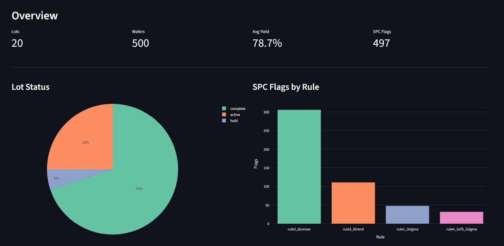
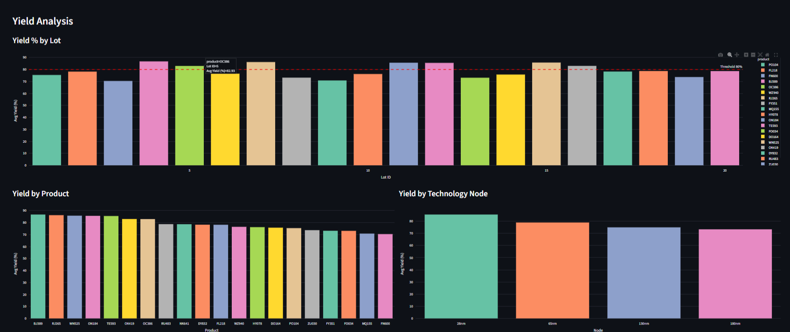
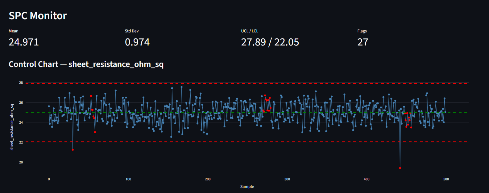
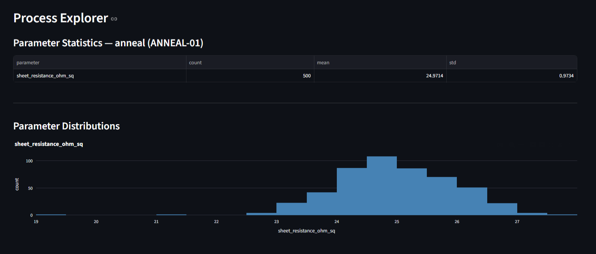
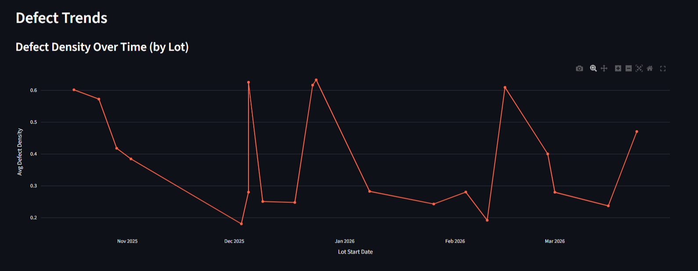

# WaferLens

  

Semiconductor process data analysis pipeline. Simulates realistic fab wafer
data, ingests it into a SQL database, and exposes analytical dashboards via
Streamlit. Demonstrates SQL schema design, data engineering, SPC algorithms,
and semiconductor domain knowledge (yield, defect density, Western Electric rules).

## Highlights

- **500 wafers** across 20 lots, 10 process steps, 11 measured parameters — 7,030 rows
- **SPC engine** implementing Western Electric rules 1–4 — 497 flags detected
- **5 Streamlit dashboard pages**: Overview, Yield Analysis, SPC Monitor, Process Explorer, Defect Trends
- **52 pytest tests**, 90% coverage overall; 99% on `analysis/spc.py`, 100% on `analysis/queries.py`

## CV Framing

- Simulated semiconductor fab process data across **500+ wafers and 20 lots** (7,030 rows across 5 normalised tables)
- Designed SQL schema modelling lot → wafer → measurement → SPC flag relationships using SQLAlchemy + Alembic
- Implemented **Western Electric SPC rules 1–4** in vectorised NumPy, detecting 497 control violations
- Built yield aggregations and defect density queries in **raw SQL** with full business logic commentary
- Delivered a **5-page Streamlit dashboard** covering yield analysis, control charts, process distributions, and defect trends
- Achieved **90% test coverage** across 52 pytest tests using in-memory SQLite fixtures

## Dashboard

### Overview


### Yield Analysis


### SPC Monitor


### Process Explorer


### Defect Trends


## Steps completed

- [x] Step 1 — Project scaffold, `db/session.py`, dependencies
- [x] Step 2 — SQLAlchemy models + Alembic migrations
- [x] Step 3 — Simulation layer (wafers, process steps, yield)
- [x] Step 4 — CSV → DB ingest (7,030 rows across 5 tables)
- [x] Step 5 — SPC engine — Western Electric rules 1–4 (497 flags)
- [x] Step 6 — Raw-SQL query layer + yield aggregations (8 query functions, 15 tests)
- [x] Step 7 — Streamlit dashboard (Overview, Yield Analysis)
- [x] Step 8 — Dashboard pages: SPC Monitor, Process Explorer, Defect Trends
- [x] Step 9 — 52 tests, 90% coverage, README polish

## Setup

```bash
python -m venv .venv
source .venv/bin/activate
pip install -r requirements.txt
cp .env.example .env
```

## How to run

```bash
# Init DB + run migrations
alembic upgrade head

# Simulate and ingest data (~7,000 rows)
python -m simulate.wafer
python -m simulate.process
python -m ingest.loader

# Run SPC analysis (writes 497 flags)
python -m analysis.spc

# Launch dashboard
streamlit run dashboard/app.py

# Tests with coverage
pytest --cov=analysis --cov=ingest --cov=db --cov=simulate --cov-report=term-missing
```

## Dashboard pages

| Page | Description |
|---|---|
| Overview | Lot status, wafer counts, SPC flag summary |
| Yield Analysis | Yield % by lot / product / technology node, defect density trend |
| SPC Monitor | Control charts with UCL/LCL, flagged point highlighting, flag history |
| Process Explorer | Parameter distributions and stats per process step |
| Defect Trends | Defect density over time, correlation with yield, breakdown by node |

## Project layout

```
db/             SQLAlchemy models + session factory + Alembic migrations
simulate/       Wafer, process step, and yield data generators
ingest/         CSV → DB loader
analysis/       SPC rules, yield aggregations, raw SQL query helpers
dashboard/      Streamlit UI (views/ subpackage holds each page)
tests/          pytest suite — in-memory SQLite, 52 tests
```

## Archive

The previous `schemaforge` project (XML layout generator/validator) is
preserved on the `schemaforge-archive` branch.

---

<div align="center">

*Engineered with caffeine and an unreasonable fondness.*
*Co-piloted by **Claude Pro**.*
</div>
