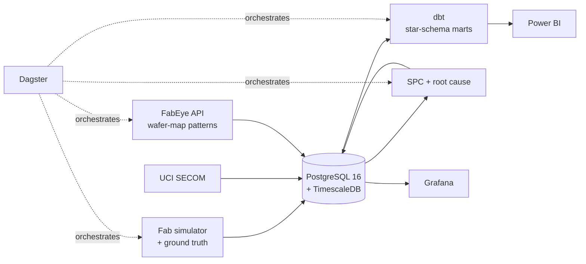

# WaferLens

[](https://github.com/anson10/waferLens/actions/workflows/ci.yml)

> **Yield dropped. Which tool or chamber caused it, how early could we have known, and what does it look like on the wafer?**

WaferLens is a fab yield excursion detection and root-cause platform: a simulated fab with
chamber-level wafer genealogy and logged ground truth, statistical process control measured
against that ground truth, commonality analysis, Grafana for live monitoring and Power BI for
yield reporting. Wafer-map pattern classification comes from its sister project,
[FabEye](https://github.com/anson10/FabEye).

**Status:** rebuilding as v2. Phase 1 (data model and simulator) of [ROADMAP.md](ROADMAP.md).
The original v1 is preserved on the
[`waferlens-v1-archive`](https://github.com/anson10/waferLens/tree/waferlens-v1-archive) branch.

## Planned architecture


```mermaid
flowchart LR
    SIM[Fab simulator<br/>+ ground truth] --> DB[(PostgreSQL 16<br/>+ TimescaleDB)]
    SECOM[UCI SECOM] --> DB
    DB --> DBT[dbt<br/>star-schema marts]
    DB --> SPC[SPC + root cause]
    SPC --> DB
    FAB[FabEye API<br/>wafer-map patterns] --> DB
    DBT --> PBI[Power BI]
    DB --> GRAF[Grafana]
    DAG[Dagster] -.orchestrates.-> SIM & DBT & SPC & FAB
```

## Quickstart

Needs Docker and [uv](https://docs.astral.sh/uv/).

```bash
cp .env.example .env
make install   # .venv + deps + git hooks
make up        # TimescaleDB on :5432, Grafana on :3000
make migrate   # create the schema (docs/schema.md)
make simulate  # 6 months of fab data as Parquet in data/demo (docs/simulator.md)
make check     # lint + typecheck + all tests
```

Run `make` with no arguments to list all targets.

## Layout

```
src/waferlens/   db, simulate, ingest, spc, rootcause, ml, stream, orchestration
tests/           unit/ (no containers) and integration/ (needs make up)
dbt/             transformation layer (phase 2)
grafana/         provisioned datasources and dashboards
powerbi/         PBIP project (phase 7)
docs/adr/        architecture decision records
```

## License

MIT
