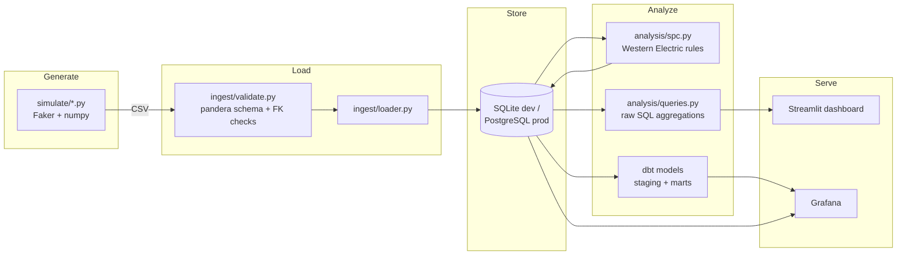
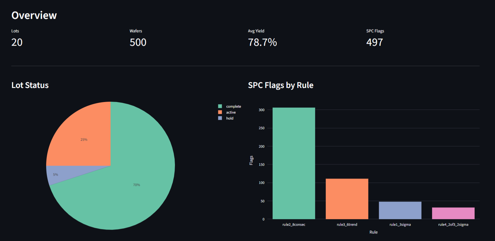
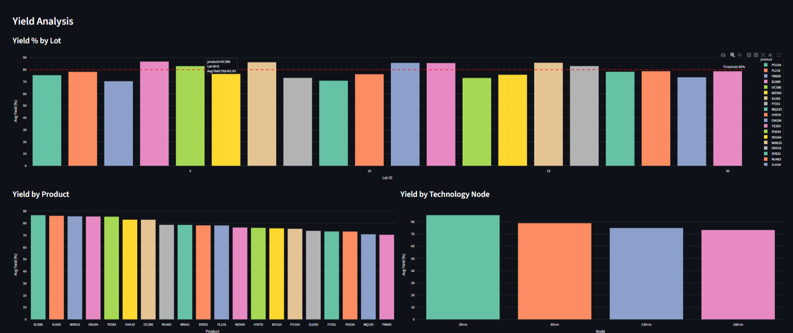
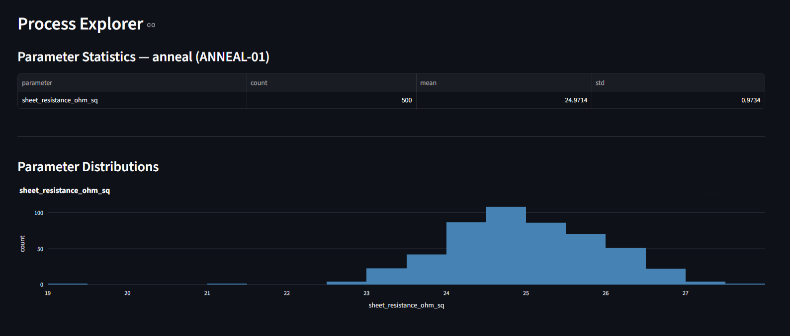
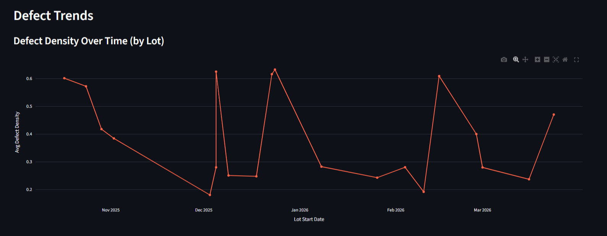

# WaferLens

 [](https://codecov.io/gh/anson10/waferLens)  

Semiconductor process data analysis pipeline. Simulates realistic fab wafer
data, ingests it into a SQL database, and exposes analytical dashboards via
Streamlit. Demonstrates SQL schema design, data engineering, SPC algorithms,
and semiconductor domain knowledge (yield, defect density, Western Electric rules).

## Architecture


```mermaid
flowchart LR
    subgraph Generate
        SIM[simulate/*.py<br/>Faker + numpy]
    end
    subgraph Load
        VAL[ingest/validate.py<br/>pandera schema + FK checks]
        LOAD[ingest/loader.py]
    end
    subgraph Store
        DB[(SQLite dev /<br/>PostgreSQL prod)]
    end
    subgraph Analyze
        SPC[analysis/spc.py<br/>Western Electric rules]
        Q[analysis/queries.py<br/>raw SQL aggregations]
        DBT[dbt models<br/>staging + marts]
    end
    subgraph Serve
        ST[Streamlit dashboard]
        GRAF[Grafana]
    end

    SIM -->|CSV| VAL --> LOAD --> DB
    DB --> SPC --> DB
    DB --> Q --> ST
    DB --> DBT --> GRAF
    DB --> GRAF
```

## Highlights

- **500 wafers** across 20 lots, 10 process steps, 11 measured parameters — 7,030 rows
- **SPC engine** implementing Western Electric rules 1–4 — 497 flags detected, with a runnable
  [anomaly-injection demo](analysis/anomaly_demo.py) showing a tool drift being caught end-to-end
- **Data quality gate**: pandera schemas + referential-integrity checks reject bad rows before they hit the DB
- **5 Streamlit dashboard pages**: Overview, Yield Analysis, SPC Monitor, Process Explorer, Defect Trends
- **Grafana dashboard** on the same Postgres data, provisioned via docker-compose (`localhost:3000`)
- **dbt project** (`dbt/`) re-implementing the yield/SPC aggregations as tested models — staging + marts, 20 data tests
- **Dockerized**: single-container SQLite build, or full docker-compose stack (Postgres + migrate + dashboard + Grafana)
- **CI**: GitHub Actions runs ruff, the pytest matrix (3.11/3.12) with Codecov upload, and a Docker build check on every push
- **60 pytest tests**, 90%+ coverage overall; 99% on `analysis/spc.py`, 100% on `analysis/queries.py`

## CV Framing

- Simulated semiconductor fab process data across **500+ wafers and 20 lots** (7,030 rows across 5 normalised tables)
- Designed SQL schema modelling lot → wafer → measurement → SPC flag relationships using SQLAlchemy + Alembic
- Implemented **Western Electric SPC rules 1–4** in vectorised NumPy, detecting 497 control violations
- Built yield aggregations and defect density queries in **raw SQL** with full business logic commentary
- Delivered a **5-page Streamlit dashboard** covering yield analysis, control charts, process distributions, and defect trends
- Achieved **90%+ test coverage** across 60 pytest tests using in-memory SQLite fixtures
- Added a **pandera data-quality gate** rejecting out-of-range yields and orphaned foreign keys before ingest
- Re-implemented core aggregations as a **dbt project** (staging + marts, 20 schema/referential data tests)
- Containerized the full stack with **Docker Compose** (Postgres, migrate/seed job, Streamlit, Grafana) and CI via **GitHub Actions**

## Dashboard

### Overview


### Yield Analysis


### SPC Monitor


### Process Explorer


### Defect Trends


## Setup

```bash
python -m venv .venv
source .venv/bin/activate
pip install -r requirements.txt
cp .env.example .env
```

## How to run

```bash
# Init DB + run migrations
alembic upgrade head

# Simulate and ingest data (~7,000 rows)
python -m simulate.wafer
python -m simulate.process
python -m ingest.loader

# Run SPC analysis (writes 497 flags)
python -m analysis.spc

# See SPC catch an injected tool-drift end-to-end
python -m analysis.anomaly_demo

# Launch dashboard
streamlit run dashboard/app.py

# Tests with coverage
pytest --cov=analysis --cov=ingest --cov=db --cov=simulate --cov-report=term-missing
```

## Run with Docker

```bash
# Dashboard only (SQLite, seeded from committed CSVs)
docker build -t waferlens .
docker run -p 8501:8501 waferlens

# Full stack (Postgres + migrate/seed + dashboard + Grafana)
docker compose up --build
```

`docker compose up` starts Postgres, runs Alembic migrations and the CSV
loader in a one-shot `migrate` service, then launches the dashboard against
Postgres at http://localhost:8501 — demonstrating the SQLite (dev) /
PostgreSQL (prod) portability called out in the stack above. Grafana comes up
at http://localhost:3000 (admin/admin, or browse anonymously as a Viewer),
pre-provisioned with a Postgres datasource and a "WaferLens — Fab Overview"
dashboard (`grafana/dashboards/waferlens.json`).

## dbt models

`dbt/` re-implements the yield and SPC aggregations from `analysis/queries.py`
as tested dbt models (staging views + mart tables), so the same business
logic can be shown in a dbt-native workflow:

```bash
cd dbt
python -m venv .dbt-venv && .dbt-venv/bin/pip install -r requirements.txt
export DBT_HOST=localhost DBT_PORT=5432 DBT_USER=waferlens DBT_PASSWORD=waferlens DBT_DBNAME=waferlens
.dbt-venv/bin/dbt deps
.dbt-venv/bin/dbt run   # builds staging + marts against the compose Postgres
.dbt-venv/bin/dbt test  # 20 data tests: not_null, unique, accepted_values, accepted_range, relationships
```

## Deploying

- **Streamlit Cloud** — the live demo; bootstraps from the committed CSVs in `data/` on cold start (SQLite).
- **Fly.io** — `fly.toml` deploys the Postgres-backed dashboard (`fly launch`, `fly postgres create` + `attach`, `fly deploy`); the release command runs migrations and seeds the DB automatically.

## Dashboard pages

| Page | Description |
|---|---|
| Overview | Lot status, wafer counts, SPC flag summary |
| Yield Analysis | Yield % by lot / product / technology node, defect density trend |
| SPC Monitor | Control charts with UCL/LCL, flagged point highlighting, flag history |
| Process Explorer | Parameter distributions and stats per process step |
| Defect Trends | Defect density over time, correlation with yield, breakdown by node |

## Project layout

```
db/             SQLAlchemy models + session factory + Alembic migrations
simulate/       Wafer, process step, and yield data generators
ingest/         CSV → DB loader + pandera data-quality validation
analysis/       SPC rules, yield aggregations, raw SQL query helpers, anomaly demo
dashboard/      Streamlit UI (views/ subpackage holds each page)
dbt/            dbt project — staging + mart models mirroring analysis/queries.py
grafana/        Provisioned datasource + dashboard JSON for the compose stack
tests/          pytest suite — in-memory SQLite, 60 tests
.github/        GitHub Actions CI (lint, test matrix, Codecov, Docker build)
```

## Archive

The previous `schemaforge` project (XML layout generator/validator) is
preserved on the `schemaforge-archive` branch.

---

<div align="center">

*Engineered with caffeine and an unreasonable fondness.*
*Co-piloted by **Claude Pro**.*
</div>
