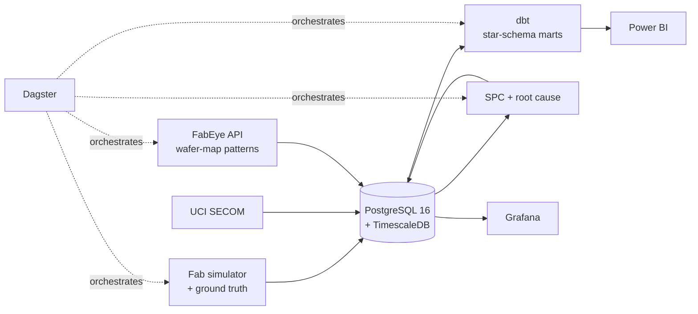

# WaferLens

[](https://github.com/anson10/waferLens/actions/workflows/ci.yml)

> **Yield dropped. Which tool or chamber caused it, how early could we have known, and what does it look like on the wafer?**

WaferLens is a fab yield excursion detection and root-cause platform: a simulated fab with
chamber-level wafer genealogy and logged ground truth, statistical process control measured
against that ground truth, commonality analysis, Grafana for live monitoring and Power BI for
yield reporting. Wafer-map pattern classification comes from its sister project,
[FabEye](https://github.com/anson10/FabEye).

**Status:** rebuilding as v2. Phase 1 (data model, simulator, loader, SECOM, performance) is done; phase 2 (dbt star schema + Dagster orchestration) is done; phase 3 has the SPC engine; benchmarking and root cause next. See [ROADMAP.md](ROADMAP.md).
The original v1 is preserved on the
[`waferlens-v1-archive`](https://github.com/anson10/waferLens/tree/waferlens-v1-archive) branch.

## Results so far

**SPC detection speed** — average points until the first alarm (simulated, 2,000 runs per
cell, within 3% of published tables; 0σ = points between false alarms):

| Chart | 0σ (false alarms) | 0.5σ | 1σ | 2σ | 3σ |
|---|---|---|---|---|---|
| Shewhart (WE rule 1) | 367 | 157 | 44 | 6.3 | 2.0 |
| Western Electric 1–4 | 91 | 28 | 9.6 | 3.5 | 1.8 |
| EWMA (λ 0.2, L 3) | 542 | 42 | 10.1 | 3.0 | 1.6 |
| CUSUM (k 0.5, h 5) | 475 | 38 | 10.6 | 4.0 | 2.5 |

On the demo fab's own ground truth, chamber-level EWMA and CUSUM first alarmed after a median of
**8–9 affected wafers vs 33 for Shewhart** (chance baseline: 140–200). Full report:
[docs/spc_benchmark.md](docs/spc_benchmark.md); decision: [ADR-006](docs/adr/0006-ewma-cusum-alongside-western-electric.md).

## Planned architecture


```mermaid
flowchart LR
    SIM[Fab simulator<br/>+ ground truth] --> DB[(PostgreSQL 16<br/>+ TimescaleDB)]
    SECOM[UCI SECOM] --> DB
    DB --> DBT[dbt<br/>star-schema marts]
    DB --> SPC[SPC + root cause]
    SPC --> DB
    FAB[FabEye API<br/>wafer-map patterns] --> DB
    DBT --> PBI[Power BI]
    DB --> GRAF[Grafana]
    DAG[Dagster] -.orchestrates.-> SIM & DBT & SPC & FAB
```

## Quickstart

Needs Docker and [uv](https://docs.astral.sh/uv/).

```bash
cp .env.example .env
make install   # .venv + deps + git hooks
make up        # TimescaleDB on :5432, Grafana on :3000
make seed      # migrate, simulate 6 months of fab data, load it + real SECOM (~2.5 min)
make check     # lint + typecheck + all tests
```

`make seed` is `make migrate simulate load`; add `PROFILE=dev` for a 1,000-wafer fab that
loads in seconds. Then `make dbt` builds and tests the star-schema marts, or `make pipeline` runs everything as one Dagster job (`make dagster` for the UI). Run `make` with no arguments to list all targets.

Docs: [schema](docs/schema.md) · [simulator](docs/simulator.md) · [dbt models](docs/dbt.md) · [pipeline](docs/pipeline.md) · [SPC](docs/spc.md) · [performance](docs/perf.md) ·
[SECOM data card](docs/data/secom.md) · [decisions](docs/adr/)

## Layout

```
src/waferlens/   db, simulate, ingest, spc, rootcause, ml, stream, orchestration
tests/           unit/ (no containers) and integration/ (needs make up)
dbt/             transformation layer (phase 2)
grafana/         provisioned datasources and dashboards
powerbi/         PBIP project (phase 7)
docs/adr/        architecture decision records
```

## License

MIT
