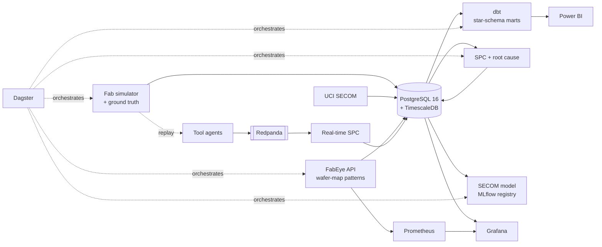
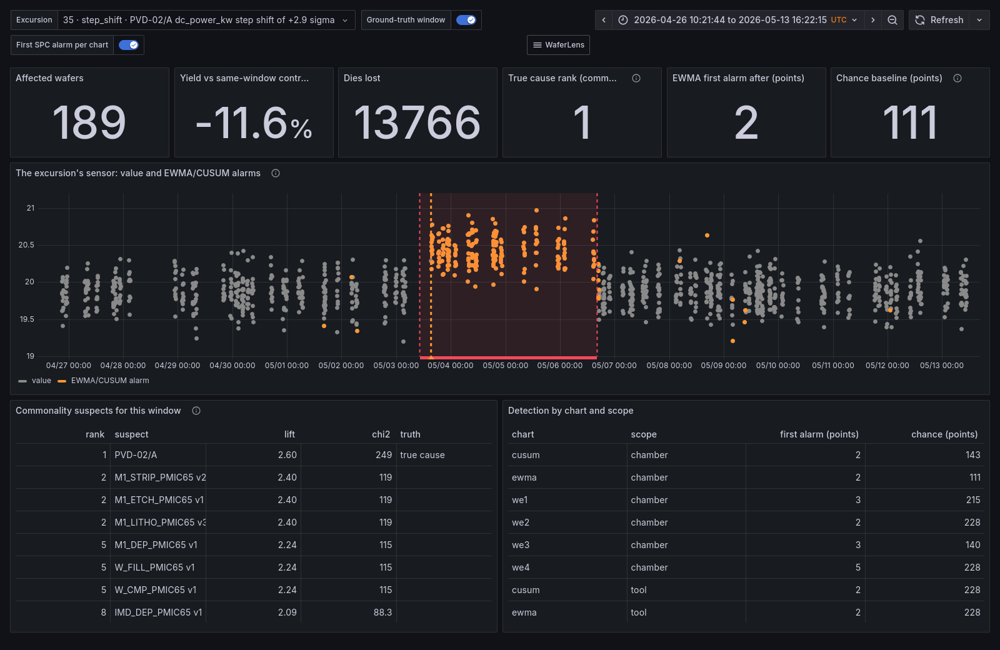
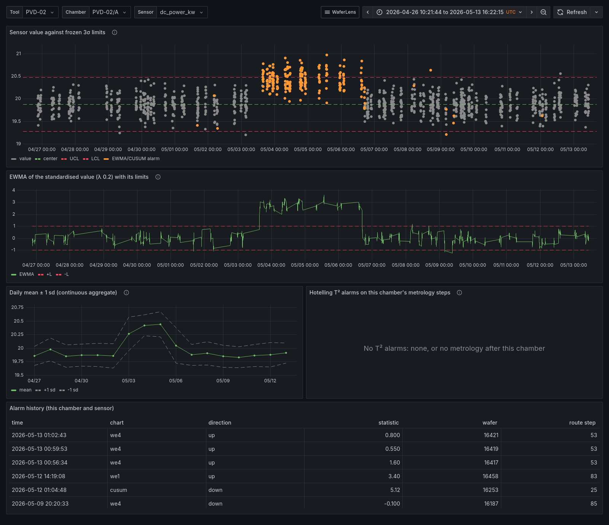
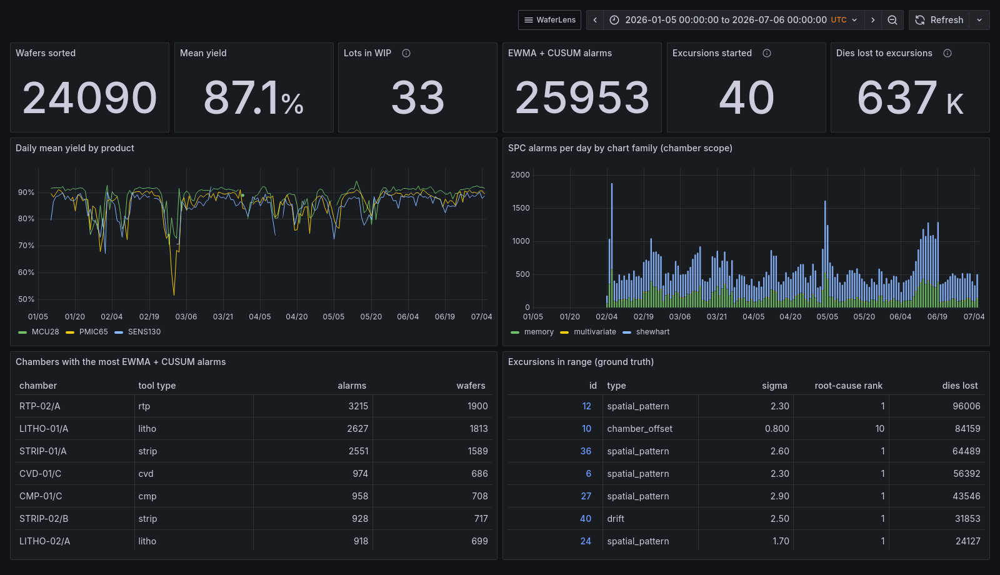
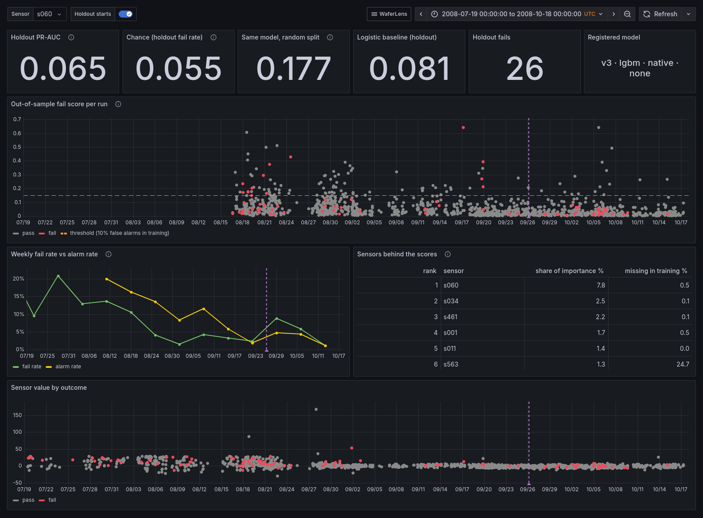
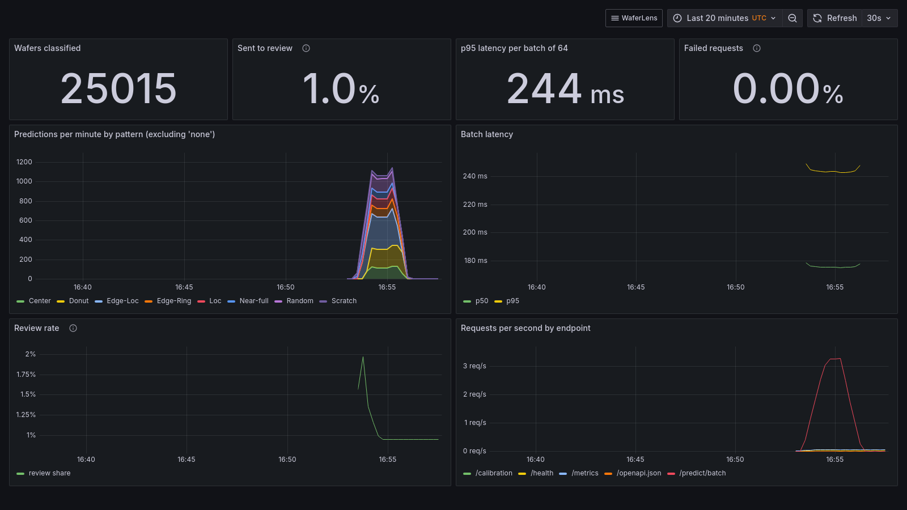
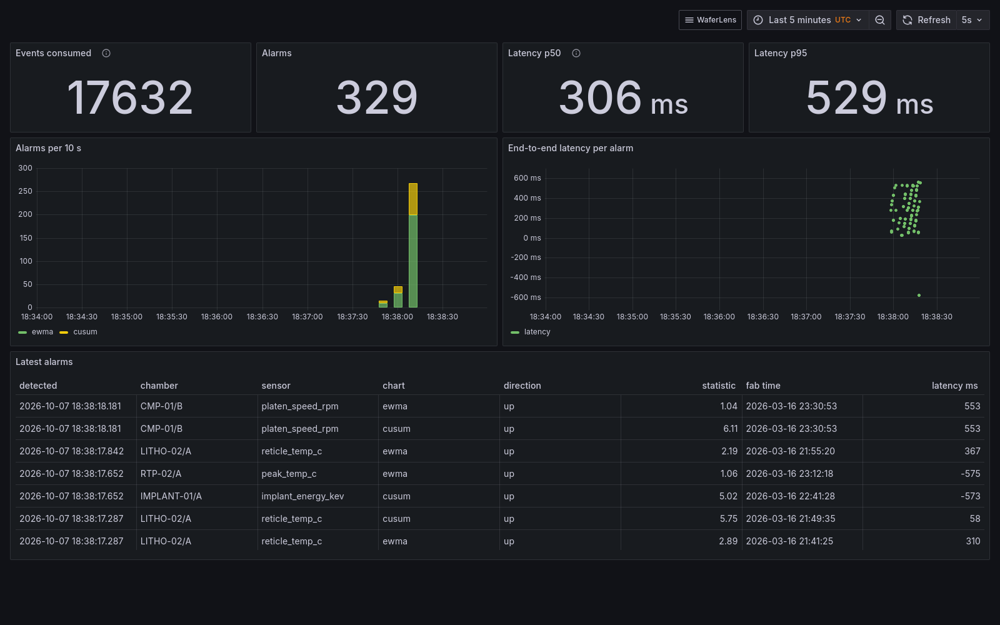
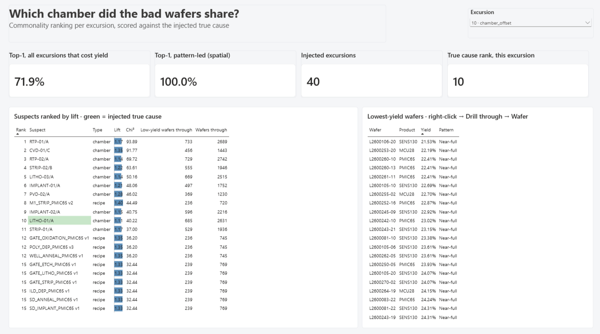
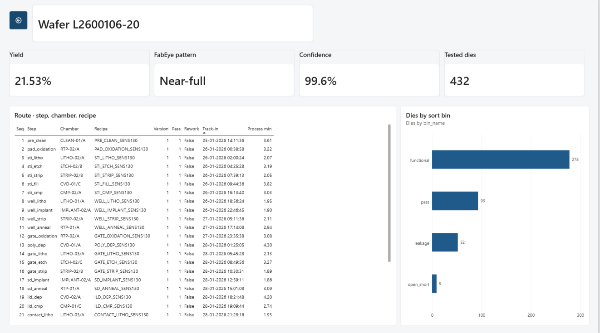
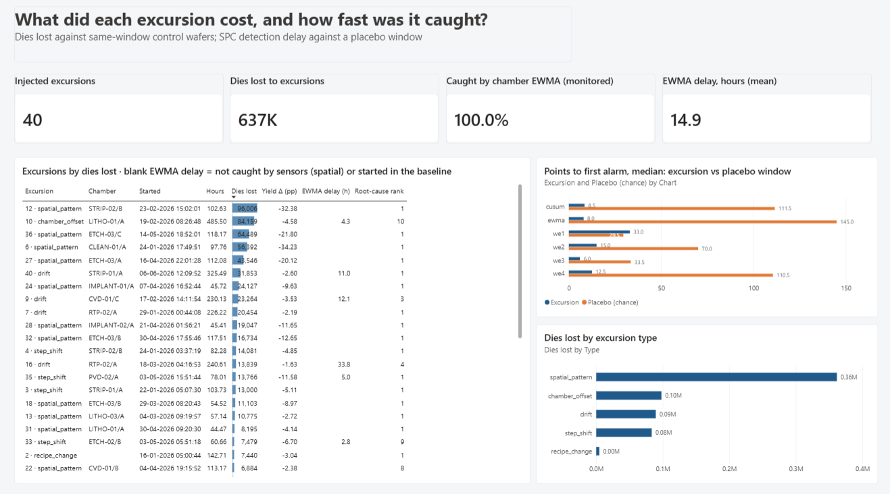

# WaferLens

[](https://github.com/anson10/waferLens/actions/workflows/ci.yml)

> **Yield dropped. Which tool or chamber caused it, how early could we have known, and what does it look like on the wafer?**

WaferLens is a fab yield excursion detection and root-cause platform: a simulated fab with
chamber-level wafer genealogy and logged ground truth, statistical process control measured
against that ground truth, commonality analysis, Grafana for live monitoring and Power BI for
yield reporting. Wafer-map pattern classification comes from its sister project,
[FabEye](https://github.com/anson10/FabEye).

**Status:** v2.0.0, complete: all eight phases of [ROADMAP.md](ROADMAP.md). The original v1, a
500-wafer Streamlit demo, is preserved on the
[`waferlens-v1-archive`](https://github.com/anson10/waferLens/tree/waferlens-v1-archive) branch.

## At a glance

Every detector is scored against the simulator's logged ground truth, next to a chance
baseline, and every number comes from a `make` target.

| Question | Method | Result | Reproduce |
|---|---|---|---|
| How early could we have known? | Chamber EWMA / CUSUM charts on frozen Phase I limits | first alarm after a median **8–9 affected wafers**, against 33 for Shewhart (chance 140–200) | `make spc-report` |
| Which chamber caused it? | Commonality analysis in SQL, from the time window alone | true cause ranked **first for 72%** of excursions that cost yield (chance 0.8%) | `make rootcause-report` |
| What does it look like on the wafer? | [FabEye](https://github.com/anson10/FabEye) wafer-map patterns, then pattern-led commonality | **13 of 13** spatial excursions caught and traced to the right chamber; SPC sees none of them | `make rootcause-report` |
| Can it run live? | Kafka events on Redpanda, online EWMA / CUSUM, exactly once through Postgres | a +2σ step caught **after 3 points**, ~270 ms event to alarm | `make stream-demo` |
| Does it hold on real fab data? | UCI SECOM, time-ordered holdout, walk-forward model selection | PR-AUC 0.065 against chance 0.055: a random split **overstates the model 2.7x** | `make secom-model` |

Three excursions told end to end, from first alarm to dies lost:
[docs/excursion_story.md](docs/excursion_story.md) (`make story`).

## Architecture


```mermaid
flowchart LR
    SIM[Fab simulator<br/>+ ground truth] --> DB[(PostgreSQL 16<br/>+ TimescaleDB)]
    SECOM[UCI SECOM] --> DB
    DB --> DBT[dbt<br/>star-schema marts]
    DB --> SPC[SPC + root cause]
    SPC --> DB
    FAB[FabEye API<br/>wafer-map patterns] --> DB
    DB --> ML[SECOM model<br/>MLflow registry]
    SIM -. replay .-> AG[Tool agents] --> RP[[Redpanda]] --> RT[Real-time SPC] --> DB
    DBT --> PBI[Power BI]
    DB --> GRAF[Grafana]
    FAB --> PROM[Prometheus] --> GRAF
    DAG[Dagster] -.orchestrates.-> SIM & DBT & SPC & FAB & ML
```

## Results

**SPC detection speed** — average points until the first alarm (simulated, 2,000 runs per
cell, within 3% of published tables; 0σ = points between false alarms):

| Chart | 0σ (false alarms) | 0.5σ | 1σ | 2σ | 3σ |
|---|---|---|---|---|---|
| Shewhart (WE rule 1) | 367 | 157 | 44 | 6.3 | 2.0 |
| Western Electric 1–4 | 91 | 28 | 9.6 | 3.5 | 1.8 |
| EWMA (λ 0.2, L 3) | 542 | 42 | 10.1 | 3.0 | 1.6 |
| CUSUM (k 0.5, h 5) | 475 | 38 | 10.6 | 4.0 | 2.5 |

On the demo fab's own ground truth, chamber-level EWMA and CUSUM first alarmed after a median of
**8–9 affected wafers vs 33 for Shewhart** (chance baseline: 140–200). Full report:
[docs/spc_benchmark.md](docs/spc_benchmark.md); decision: [ADR-006](docs/adr/0006-ewma-cusum-alongside-western-electric.md).

**Root cause** — given only the time window of each injected excursion, commonality analysis
(which chamber or recipe version the low-yield wafers share) ranked the true cause **first for
23 of 32 excursions that measurably cost yield (72%)**, top 3 for 75%, against 0.8% for a random
pick among ~129 suspects. SPC and commonality cover each other: 35 of 40 excursions are found by
at least one; SPC can't see spatial defect patterns, commonality finds 11 of 13 of them.
Report: [docs/root_cause.md](docs/root_cause.md); three excursions end to end in
[docs/excursion_story.md](docs/excursion_story.md).

**Fail prediction on real fab data (UCI SECOM)** — 590 anonymised sensors, 1,567 runs, 6.6%
fails, with a fail rate that drifts from 22% to 3% within three months. Trained on the first
70% of runs, model chosen by walk-forward CV, scored once on the last 30%:

| | PR-AUC on the time-ordered holdout | Same model, random split |
|---|---|---|
| LightGBM (chosen in CV) | 0.065 (95% CI 0.054–0.091) | 0.177 |
| Logistic regression (baseline) | 0.081 | 0.128 |
| Chance (holdout fail rate) | 0.055 | |

Forward in time the sensors barely predict fails, and **a random split, the evaluation most
published SECOM results use, overstates the model 2.7x**. Both models rank sensor 60 first.
Runs and the registered model are tracked in MLflow. Report: [docs/secom_model.md](docs/secom_model.md);
decision: [ADR-008](docs/adr/0008-secom-time-split-and-pr-auc.md).

**Wafer-map patterns from [FabEye](https://github.com/anson10/FabEye)** — WaferLens doesn't
train a wafer-map model; it calls FabEye's API for every sorted wafer and scores the answers
against the simulator's per-wafer ground truth, a domain-shift test FabEye couldn't run on
WM-811K:

| | Simulated fab (24,090 wafers) | FabEye on unseen real lots |
|---|---|---|
| Macro-F1 | 0.909 | 0.858 |
| 90% prediction set covers the truth | 97.1% | 89.3% |
| Worst class coverage | **52% (Random)** | 86% |

The simulated patterns are cleaner than real ones, so the overall score flatters FabEye; the
finding is where its guarantees break: strong uniform "random" defect fields get called
Near-full, and 450 maps get an empty prediction set. Report: [docs/fabeye_eval.md](docs/fabeye_eval.md);
decision: [ADR-010](docs/adr/0010-consume-fabeye-as-a-service.md).

The pattern also closes SPC's blind spot. Starting from the pattern on the wafers,
commonality ranks the true chamber **first for 13 of 13 spatial excursions** (low yield: 11 of
13), and a pattern alarm on sorted wafers **caught all 13, which SPC can't see at all**, a
median 52 h after the excursion started, almost all of it the time wafers take to reach sort.
Guessing the pattern from the time window instead failed (top-1 fell from 72% to 47%):
overlapping excursions put some pattern in almost every window. Details in
[docs/root_cause.md](docs/root_cause.md#wafer-map-patterns-phase-5a).

## Grafana

Six dashboards and two alert rules, all provisioned from git: nothing is clicked together
in the UI. The dashboards are generated by `src/waferlens/dashboards/build.py` (`make
dashboards`), and Grafana connects as `grafana_reader`, a role that can only `SELECT`.

**Excursion review**: one injected excursion end to end, here a +2.9σ step on a PVD
chamber that cost 189 wafers 11.6 yield points. The red band is the ground-truth window and
the orange lines are the first alarm of each chart: EWMA fired 2 points in, against 111 in
the same-length window before it. The commonality table ranks the true chamber first of 131
suspects, from the time window alone.



**SPC control chart**: pick tool, chamber and sensor. Raw values against the frozen 3σ limits
with EWMA/CUSUM alarms marked, the EWMA statistic computed in SQL (a custom `ewma()`
aggregate used as a window function), and daily means from a TimescaleDB continuous aggregate
(~100x faster than scanning the raw readings, [docs/perf.md](docs/perf.md)).



**Fab overview**: wafers, yield by product, SPC alarms per day, the noisiest chambers, and
every excursion with its root-cause rank, linking to its review.



**SECOM fail prediction**: the registered model's out-of-sample score per run (walk-forward
before the holdout line, the registered model after it), the drifting fail rate against the
alarm rate, and the sensors behind the scores.



**FabEye serving** (Prometheus): the classifier as a service, scraped every 15 s: predictions
per minute by pattern, the review queue, batch latency and errors.



**Real-time SPC** (`make stream-demo`): tool agents replay a day of the fab as Kafka events on
Redpanda (17,632 events); a consumer keeps EWMA/CUSUM state per chamber and sensor. A +2σ
step injected on one chamber is caught **after 3 points**, about 270 ms (p50) from event to
alarm. Alarms, chart state and Kafka offsets commit in one Postgres transaction, so a crash
or a replay can't lose or duplicate an alarm, and on the dev fab the stream raises exactly
the batch engine's alarms. Decision: [ADR-012](docs/adr/0012-real-time-spc-on-redpanda.md).



**Alerts** (`grafana/provisioning/alerting/`): an EWMA alarm burst on one chamber, and a
chamber's yield falling 3 points below its products' median over a week. Both post to a
webhook sink; `docker compose logs alert-sink` shows the notifications.

## Power BI

A semantic model on the dbt marts, saved as PBIP so every measure, relationship and page is a
text file in git ([`powerbi/`](powerbi/), ADR-011): 21 tables in Import mode as the read-only
`powerbi_reader`, 28 single-direction relationships, 39 DAX measures in display folders, and
row-level security with one role per product.

**Root cause:** pick an excursion and every chamber and recipe is ranked by lift, with the
injected true cause in green, next to each chamber's SPC alarms during the excursion.
Excursion 10 is the honest miss: commonality ranks the true chamber 10th, while SPC raised 3,740
alarms on it in the window (428 on the top-ranked suspect). The two methods catch different
failures. Right-click a low-yield wafer to drill through to it.



**Wafer drillthrough:** the worst wafer in the fab (21.53%, FabEye: Near-full) went through
CLEAN-01/A at its first step, the chamber excursion 6 was injected on.



**Excursions:** dies lost per excursion against same-window control wafers, and the median
points to the first alarm next to a placebo window: EWMA 8 against 145, while WE1 (33 against
29.5) is no better than chance.



More: [executive summary](powerbi/images/executive-summary.png),
[yield-loss Pareto](powerbi/images/yield-loss.png),
[row-level security as PMIC65](powerbi/images/rls.png).

## Quickstart

Needs Docker and [uv](https://docs.astral.sh/uv/).

```bash
cp .env.example .env
make install    # .venv + deps + git hooks
make up         # TimescaleDB :5432, Grafana :3000, MLflow :5000, FabEye :8000, Prometheus :9090
make pipeline   # one Dagster run (~16 min): simulate 6 months of fab data, load it + real
                # SECOM, dbt, SPC, FabEye patterns, root cause, SECOM model
make story      # three excursions end to end → docs/excursion_story.md
make stream-demo    # real-time SPC: starts Redpanda (:19092), replays a day, injects a drift
make check      # lint + typecheck + all tests
```

`make seed` runs only `migrate simulate load`; add `PROFILE=dev` for a 1,000-wafer fab that
loads in seconds. `make dagster` opens the pipeline UI on :3001. Run `make` with no arguments
to list all targets.

After `make pipeline`, the dashboards are at <http://localhost:3000> (admin / admin, from
`.env`) in the WaferLens folder, and MLflow at <http://localhost:5000>; `make secom-model`
retrains the SECOM model on its own (~3 min), `make screenshots` re-renders the images above.

All docs, reports and decisions: [docs/](docs/README.md).

## Layout

```
src/waferlens/   db, simulate, ingest, spc, rootcause, ml, patterns, dashboards, stream, orchestration
tests/           unit/ (no containers) and integration/ (needs make up)
dbt/             staging, intermediate and star-schema marts
grafana/         provisioned datasources and dashboards
powerbi/         Power BI project (PBIP): semantic model, report, screenshots
docs/            reports, how-it-works docs, decisions (docs/adr/)
```

## Kurzbeschreibung (Deutsch)

WaferLens ist eine Plattform zur Erkennung von Yield-Exkursionen und zur Ursachenanalyse in der
Halbleiterfertigung. Ein simulierter Fab mit Wafer-Genealogie auf Kammerebene protokolliert
jede eingespeiste Störung als Ground Truth; daran wird jede Methode gemessen, immer gegen eine
Zufalls-Baseline:

- **SPC** (Western-Electric-Regeln, EWMA, CUSUM, Hotelling T²): Kammer-EWMA und -CUSUM schlagen
  im Median nach 8–9 betroffenen Wafern Alarm, Shewhart erst nach 33 (Zufall: 140–200).
- **Commonality-Analyse** in SQL: Die wahre Ursache steht bei 72 % der Exkursionen mit
  Yield-Verlust auf Platz 1 (Zufall: 0,8 %).
- **Wafer-Map-Muster** über den FabEye-Service: Alle 13 räumlichen Exkursionen, die SPC nicht
  sieht, werden erkannt und der richtigen Kammer zugeordnet.
- **Echtzeit-SPC** auf Redpanda (Kafka-API), exactly-once über Postgres: Eine Drift wird nach
  3 Messpunkten erkannt, mit rund 270 ms Latenz.
- **Fehlervorhersage auf echten Fertigungsdaten** (UCI SECOM) mit zeitlich geordnetem Split:
  Ein zufälliger Split überschätzt das Modell um den Faktor 2,7.

Stack: PostgreSQL/TimescaleDB, dbt (Sternschema), Dagster, Grafana (Dashboards als Code),
Power BI (PBIP, DAX, Row-Level Security), MLflow, Docker, GitHub Actions. Jede Zahl in diesem
README ist über ein `make`-Target reproduzierbar.

## License

MIT
