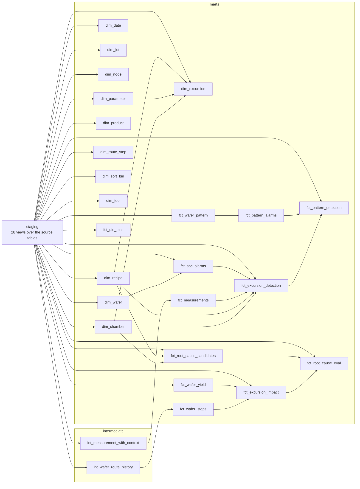

# dbt project

Generated by `make dbt-docs` from `dbt/target/manifest.json`; don't edit by hand.

54 models (28 staging views, 2 intermediate,
24 marts), 141 data tests and 3 unit tests. Marts are a star schema
in the `marts` schema: facts at a stated grain joined to dimensions on surrogate keys, which is
what Power BI imports in phase 7.

## Lineage

## Intermediate and mart models

| Model | Layer | Materialized | Tests | Description |
|---|---|---|---|---|
| `int_measurement_with_context` | intermediate | view | 0 | Sensor readings and metrology wafer means, unified, with spec limits. |
| `int_wafer_route_history` | intermediate | view | 4 | Genealogy with step, chamber, tool and recipe context, queue time and final-pass flag. |
| `dim_chamber` | marts | table | 8 | Chambers with tool and tool type flattened in; labelled like ETCH-02/B. |
| `dim_date` | marts | table | 9 | Calendar days (UTC) covering the data; Power BI's date table. |
| `dim_excursion` | marts | table | 3 | One row per injected excursion: type, cause (chamber, recipe), affected sensor, spatial pattern as FabEye names it, magnitude and window. The shared dimension of the excursion-grain facts. |
| `dim_lot` | marts | table | 11 | Lots with split lineage (recursive CTE up parent_lot_id). |
| `dim_node` | marts | table | 3 | Technology nodes (28nm, 65nm, 130nm). |
| `dim_parameter` | marts | table | 5 | Sensors and metrology parameters with units. |
| `dim_product` | marts | table | 6 | Products with their node flattened in (die area, map size, gross dies). |
| `dim_recipe` | marts | table | 7 | Recipe versions with the window each was in force (lead over versions). |
| `dim_route_step` | marts | table | 5 | Steps of each product's route, with the tool type and whether metrology follows. |
| `dim_sort_bin` | marts | table | 3 | Wafer sort bins; bin 1 is the only pass bin. |
| `dim_tool` | marts | table | 4 | Tools with their type and chamber count. |
| `dim_wafer` | marts | table | 8 | Wafers with their current lot, product, slot and status. |
| `fct_die_bins` | marts | table | 9 | One row per sorted wafer x bin, with the bin's share of the wafer. |
| `fct_excursion_detection` | marts | table | 8 | One row per injected excursion x SPC chart x scope, scoring Phase II SPC against the simulator's ground truth: detected or not, delay in hours and affected points, a placebo window before the excursion, and whether it started inside the baseline window. |
| `fct_excursion_impact` | marts | table | 3 | One row per injected excursion: affected wafers, their yield against same-product wafers processed in the same window that escaped it, and the dies lost. |
| `fct_measurements` | marts | incremental | 15 | Sensor readings and metrology wafer means at one grain (wafer x route step x pass x parameter), each tied to the chamber, recipe and lot of that step. Incremental. |
| `fct_pattern_alarms` | marts | table | 5 | One row per wafer whose sort result raised a wafer-map pattern alarm: at least max(3, 3 x background per day) auto-accepted wafers with the same FabEye pattern sorted within 24 hours, background from the first 30 days. |
| `fct_pattern_detection` | marts | table | 3 | One row per injected spatial-pattern excursion: whether the wafer-map pattern alarm caught it, the delay from the excursion's start (and the sort lag that bounds it), a placebo window before it, and whether SPC caught it. |
| `fct_root_cause_candidates` | marts | table | 5 | Ranked suspects (chambers, recipe versions) per excursion window, with the true cause flagged. |
| `fct_root_cause_eval` | marts | table | 4 | One row per excursion with the true cause's rank (top-1 / top-3) and its yield impact. |
| `fct_spc_alarms` | marts | table | 11 | One row per SPC alarm (a point that signalled on one chart of one series), with its series scope, chamber, parameter, wafer, lot and product. Written by waferlens.spc. |
| `fct_wafer_pattern` | marts | table | 8 | One row per sorted wafer with FabEye's predicted WM-811K pattern, confidence, review flag and conformal prediction set, next to the simulator's true pattern. |
| `fct_wafer_steps` | marts | table | 9 | One row per wafer x route step x pass with chamber, recipe, queue and process time. |
| `fct_wafer_yield` | marts | table | 14 | One row per sorted wafer with dies tested, good dies, yield and cycle time. |
