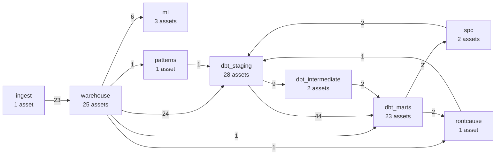

# Pipeline (Dagster)

Generated by `make pipeline-docs` from `waferlens.orchestration.definitions`; don't edit by hand.

86 assets in 9 groups and 123 asset checks:
`fab_contracts` on `simulated_fab` (blocking), plus 122 dbt tests, which dagster-dbt runs as blocking
checks on the model they test. Edge labels count the asset-to-asset links between groups.

## Lineage by group

## Jobs

| Job | Assets | What it does |
|---|---|---|
| `full_rebuild` | 86 | Simulate, check contracts, load, load SECOM, build dbt, run SPC and root cause. |
| `ingest` | 76 | Load the current Parquet drop and rebuild everything downstream of it. |

## Triggers (start stopped; enable in the UI)

| Kind | Name | Runs | When |
|---|---|---|---|
| sensor | `new_parquet_drop` | `ingest` | every 60 s |
| schedule | `nightly_rebuild` | `full_rebuild` | `0 3 * * *` (UTC) |
