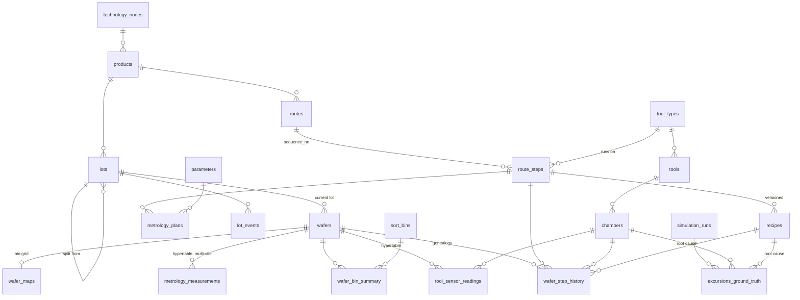

# Schema

Source of truth: `src/waferlens/db/migrations/versions/`. Models: `src/waferlens/db/models.py`.

## Groups

| Group | Tables | Notes |
|---|---|---|
| Master data | `technology_nodes`, `products`, `routes`, `route_steps`, `tool_types`, `tools`, `chambers`, `recipes`, `parameters`, `metrology_plans`, `sort_bins` | Spec limits (LSL / target / USL) live in `metrology_plans` |
| Production | `lots`, `lot_events`, `wafers`, `wafer_step_history` | `wafer_step_history` records chamber, recipe and lot for every wafer × step × pass |
| Results | `tool_sensor_readings`*, `metrology_measurements`*, `wafer_maps`, `wafer_bin_summary` | * TimescaleDB hypertables, 7-day chunks |
| Ground truth | `simulation_runs`, `excursions_ground_truth` | What the simulator injected; detection is scored against it |
| Materialized view | `wafer_yield` | Good / tested dies per wafer, pass bins from `sort_bins.is_pass`; refreshed by the loader (migration 0003, docs/perf.md) |
| External (real data) | `secom_runs`, `secom_readings` | UCI SECOM in long format, separate metadata so fab reloads never touch it ([data card](data/secom.md)) |

## Design choices worth knowing

- **Genealogy at chamber level.** Root cause in a fab is usually one chamber of one tool, not
  the whole tool. `wafer_step_history` is indexed on `(chamber_id, track_in)` for "which wafers
  went through chamber X in this window" (ADR-002).
- **Rework is a second pass**, not an overwrite: the key is `(wafer_id, route_step_id, pass_no)`.
- **Lot splits** keep `lots.parent_lot_id`; the lot a wafer was in *at each step* is in
  `wafer_step_history.lot_id`, because `wafers.lot_id` only holds the current lot.
- **Wafer maps are one 2-D `smallint[][]` per wafer** (0 = off wafer, 1 = pass, ≥ 2 = fail bin),
  not one row per die: ~25k rows instead of ~12M for the demo profile (ADR-003). FabEye's
  input is this grid with every fail bin mapped to 2.
- **Hypertable keys start with `time`**, so TimescaleDB's default time index is skipped as a
  duplicate.
- **Constraints live in the database**, not just in Python, because the bulk loader uses
  `COPY` and bypasses the ORM. `tests/integration/test_schema.py` checks each one.
