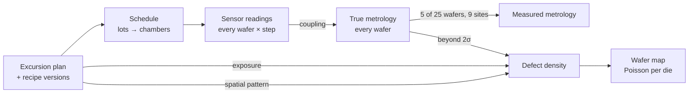

# Simulator

`python -m waferlens.simulate --profile demo --seed 42` (or `make simulate`) writes one Parquet
file per database table to `data/<profile>/`, plus a `manifest.json` summary. The fab itself
(products, route, tools, sensors, specs, excursion mix) is defined in `config/fab.yaml`.

## Profiles

| Profile | Lots | Wafers | Period | Rows | Time | Use |
|---|---|---|---|---|---|---|
| `dev` | 40 | 1,000 | 30 days | ~170k | < 1 s | tests, CI |
| `demo` | 1,000 | 25,000 | 182 days | 4.74M | ~5–20 s | README results, Grafana, Power BI, FabEye |
| `stress` | 5,000 | 125,000 | 365 days | ~24M | — | performance write-up (phase 1e) |

`demo` with seed 42: 740k genealogy rows, 2.96M sensor readings, 985k metrology sites,
24,090 sorted wafer maps, 1,018 lots (18 from splits), 40 excursions
(12 step shifts, 5 drifts, 6 chamber offsets, 4 recipe changes, 13 spatial patterns).
Wafer yield: mean 87.1%, median 89.8%, 10th percentile 80.6%. Peak memory is about 1 GB.

## The fab

- 3 products on 28nm, 65nm and 130nm, each running its own copy of a 30-step route
  (STI, wells, gate, source/drain, contact, M1).
- 9 tool types, 20 tools, 40 chambers. Etch, CVD and CMP tools have 3 chambers each.
- 12 steps have inline metrology (22 parameters, 9 sites per wafer, 5 of 25 wafers per lot),
  with spec limits at ±4σ. CD-like targets scale with the node.

## How a wafer's data is generated

1. **Plan.** Excursions are drawn before anything runs, so ground truth is exact.
   Chamber excursions never overlap on the same chamber. A recipe change creates a bad version
   at the start and a revert at the end. A few harmless recipe updates are added as noise.
2. **Schedule.** A lot queues (exponential, 3 h mean), may be held once, then tracks into one
   tool; its wafers spread across that tool's chambers by slot. Litho steps are sometimes
   reworked (second pass), some lots split, a few wafers scrap. Everything after the end of
   the period is cut, which leaves realistic work in progress (active lots, unsorted wafers).
3. **Sensors.** Four per tool type, z = static chamber bias + noise + excursion effect on the
   tool's primary sensor (step: constant; drift: linear ramp; offset: small constant).
4. **Metrology.** True values exist for every wafer. The first parameter of a step is
   `sqrt(1-c²)·noise + c·primary sensor z` (c = 0.7), so an in-control step keeps unit
   variance and a sensor excursion moves metrology. Recipe changes shift metrology directly.
   Only sampled wafers are measured, with a radial within-wafer profile and site noise.
5. **Sort.** Poisson yield per die: `P(fail) = 1 - exp(-A · D0)`, where local D0 adds
   - base node D0, higher at the wafer edge, multiplied by excursion exposure above 0.5σ;
   - a parametric term from true metrology beyond 2σ;
   - a spatial pattern field (center, donut, edge ring, edge loc, loc, scratch, random)
     on wafers through a pattern chamber during its window. The geometry is fixed per
     excursion, as a real chamber defect would be.

   The fail bin follows the cause: the tool type's bin for patterns, leakage for parametric
   loss, functional / open-short otherwise.

## What this makes possible later

- **SPC (phase 3)** sees step shifts and drifts on sensors, and through coupling on metrology,
  but chamber offsets are deliberately small (0.5–1σ) to test EWMA/CUSUM against Shewhart.
- **Spatial-pattern excursions don't touch any sensor or metrology.** Only the wafer map shows
  them, which is the case FabEye exists for (phase 5).
- **Commonality analysis** can be scored: every excursion has a known chamber or recipe and
  window in `excursions_ground_truth`.

## Simplifications

- No tool capacity or queueing between lots; lots never block each other.
- No batch tools (furnaces), so genealogy is always one wafer, one chamber (ADR-0002).
- One metrology tool per step is implied; metrology tool matching isn't modelled.
- Sensor values are per-wafer summaries, not traces.
