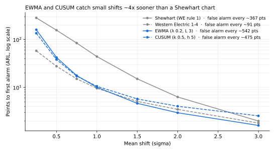

# SPC benchmark

Generated by `make spc-report`; don't edit by hand. Methods: `docs/spc.md`. Decision: ADR-006.

## 1. Average run length (simulation)

Zero-state ARL: the mean shifts by the given number of sigma from the first point, and each
cell is the mean number of points until the chart signals (2,000 runs each). The 0σ column is
ARL₀, the mean number of points between false alarms; every other column is a detection delay.

| Chart | 0σ | 0.25σ | 0.5σ | 0.75σ | 1σ | 1.5σ | 2σ | 3σ |
|---|---|---|---|---|---|---|---|---|
| Shewhart (WE rule 1) | 367.1 | 283.5 | 156.5 | 84.2 | 44.0 | 15.1 | 6.3 | 2.0 |
| Western Electric 1-4 | 90.5 | 58.0 | 27.7 | 15.1 | 9.6 | 5.1 | 3.5 | 1.8 |
| EWMA (λ 0.2, L 3) | 541.7 | 160.2 | 42.1 | 17.7 | 10.1 | 4.6 | 3.0 | 1.6 |
| CUSUM (k 0.5, h 5) | 475.1 | 135.3 | 38.2 | 17.2 | 10.6 | 5.7 | 4.0 | 2.5 |

Two correlated parameters (ρ = 0.6), one of them shifting; T² against a 3σ chart on each
parameter separately:

| Chart | 0σ | 0.5σ | 1σ | 2σ | 3σ |
|---|---|---|---|---|---|
| Hotelling T² (p 2, ρ 0.6) | 369.0 | 159.1 | 39.2 | 4.4 | 1.5 |
| Shewhart on each parameter | 200.3 | 115.0 | 41.2 | 6.4 | 2.0 |

**Reading it:** at 0.5σ a Shewhart chart needs ~156 points, EWMA ~42 and CUSUM ~38, while both
false-alarm *less* often (ARL₀ ~540 and ~475 vs ~370). Western Electric rules 1-4 together are
faster still, but at an ARL₀ of ~90: a false alarm every 90 points. For large shifts (3σ) every
chart signals within 2-3 points, so Shewhart's one-point rule stays useful as a backstop.

### Check against published values

| Chart | Shift | Simulated | Published | Difference |
|---|---|---|---|---|
| Shewhart (WE rule 1) | 0σ | 367.1 | 370.4 | -0.9% |
| Shewhart (WE rule 1) | 0.5σ | 156.5 | 155.2 | +0.9% |
| Shewhart (WE rule 1) | 1σ | 44.0 | 43.9 | +0.3% |
| Shewhart (WE rule 1) | 1.5σ | 15.1 | 15.0 | +0.4% |
| Shewhart (WE rule 1) | 2σ | 6.3 | 6.3 | +0.1% |
| Shewhart (WE rule 1) | 3σ | 2.0 | 2.0 | -0.8% |
| CUSUM (k 0.5, h 5) | 0σ | 475.1 | 465.0 | +2.2% |
| CUSUM (k 0.5, h 5) | 0.25σ | 135.3 | 139.0 | -2.7% |
| CUSUM (k 0.5, h 5) | 0.5σ | 38.2 | 38.0 | +0.5% |
| CUSUM (k 0.5, h 5) | 0.75σ | 17.2 | 17.0 | +1.2% |
| CUSUM (k 0.5, h 5) | 1σ | 10.6 | 10.4 | +1.5% |
| CUSUM (k 0.5, h 5) | 1.5σ | 5.7 | 5.8 | -0.2% |
| CUSUM (k 0.5, h 5) | 2σ | 4.0 | 4.0 | +0.8% |
| CUSUM (k 0.5, h 5) | 3σ | 2.5 | 2.6 | -1.0% |

## 2. Detection on the demo fab (ground truth)

`marts.fct_excursion_detection` scores every chart against every injected excursion
(chamber and tool scope), using only alarms on affected points. Excursion windows run for
days, so *some* false alarm inside one is likely; the chance baseline is the median number of
affected points until the first alarm in an equal-length window right before the excursion,
where there is nothing to detect. Excursions that started inside the 30-day baseline are left
out (their limits may have learned the shift).

| Scope | Chart | Excursions | Median delay (points) | Median delay (h) | Chance baseline (points) | Faster than chance |
|---|---|---|---|---|---|---|
| chamber | `we1` | 20 | 33 | 25.5 | 206 | 80% |
| chamber | `we2` | 20 | 15 | 6.9 | 171 | 90% |
| chamber | `we3` | 20 | 6 | 5.2 | 142.5 | 85% |
| chamber | `we4` | 20 | 12.5 | 6.1 | 133 | 95% |
| chamber | `ewma` | 20 | 8 | 6.6 | 193.5 | 95% |
| chamber | `cusum` | 20 | 8.5 | 5.5 | 171.5 | 90% |
| chamber | `t2` | 3 | 17 | 68.5 | 20 | 67% |
| tool | `we1` | 20 | 30.5 | 12.2 | 206 | 80% |
| tool | `we2` | 20 | 18.5 | 11.2 | 225 | 90% |
| tool | `we3` | 20 | 13 | 9.2 | 148 | 75% |
| tool | `we4` | 20 | 37.5 | 16.0 | 48.5 | 55% |
| tool | `ewma` | 20 | 12.5 | 7.9 | 188.5 | 90% |
| tool | `cusum` | 20 | 18.5 | 8.3 | 187.5 | 90% |

| Excursion type | Injected | Watched by a chart | Started inside baseline |
|---|---|---|---|
| chamber_offset | 6 | 6 | 1 |
| drift | 5 | 5 | 1 |
| recipe_change | 4 | 4 | 1 |
| spatial_pattern | 13 | 0 | 0 |
| step_shift | 12 | 12 | 4 |

**Reading it:** at chamber scope EWMA and CUSUM raise their first alarm after a median of
8-9 affected points, Shewhart after ~33, against a chance baseline of 140-200 points. Pooling a
tool's chambers (tool scope) slows EWMA and CUSUM and nearly disables WE rule 4, whose
"8 in a row on one side" fires on the chambers' static offsets. Spatial-pattern excursions
are watched by no chart at all: they change no sensor or metrology value, only the wafer map
(phase 5, FabEye). T² saw too few recipe-change cases on demo to conclude anything.
